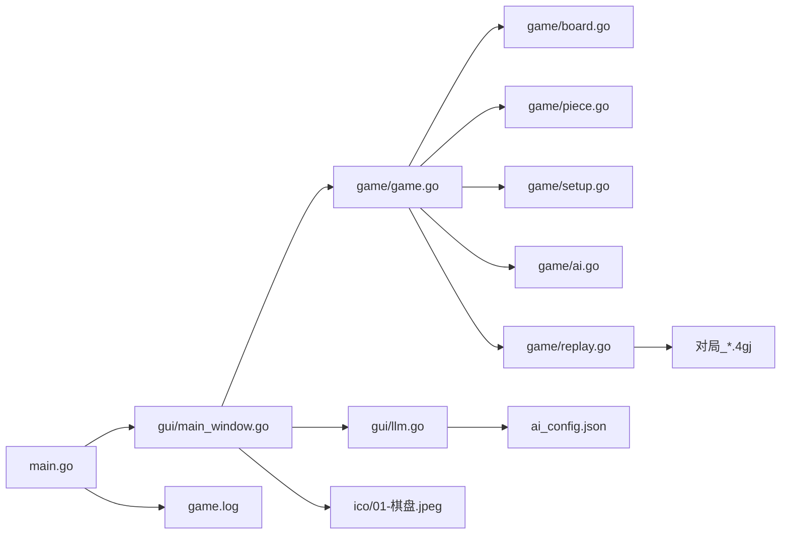
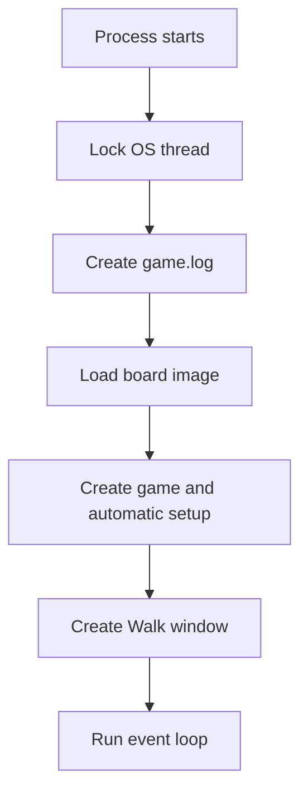
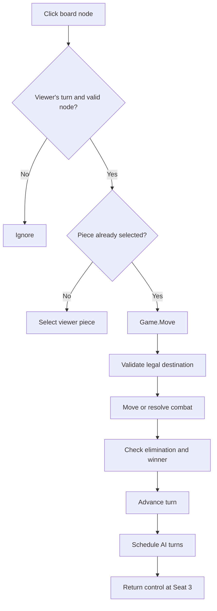

# FourJun Architecture

## 1. Scope

FourJun is a Windows desktop prototype of four-country military chess. The current product is a local game in which the human controls Seat 3 and Seats 1, 2, and 4 use a strategic AI with selectable difficulty (初级/中级/高级/大模型). It does not currently provide networking, manual setup, replay, or persistence.

This document describes the implementation in the repository. `doc/design.md` and `doc/rules.md` are product/rule references and include capabilities that are not implemented.

## 2. System Overview

The process has one native Walk window. The `gui` package owns rendering, input, timing, sound, and AI turn scheduling. The `game` package owns board topology, setup constraints, turn state, legal movement, combat, visibility, elimination, and victory.

## 3. Repository Map

| Path | Responsibility |
| --- | --- |
| `main.go` | Locks the Windows UI thread, redirects output to `game.log`, and starts the GUI |
| `gui/main_window.go` | Creates the window, paints the board, maps pointer coordinates, and runs human/AI turns |
| `game/piece.go` | Piece, seat, team, rank, inventory, and movability definitions |
| `game/board.go` | Immutable 17x17 cross-board topology plus mutable piece occupancy |
| `game/setup.go` | Setup validation and deterministic automatic setup |
| `game/game.go` | Game phases, movement, combat, visibility, elimination, and victory |
| `game/ai.go` | Strategic AI engine: difficulty parameters, move scoring (attack/advance/defend/cooperate), fair-information reasoning, LLM prompt and parsing |
| `game/replay.go` | Move recording (`MoveRecord`), persisted `GameRecord` (JSON `.4gj`), and the `Replay` stepper used for review |
| `gui/llm.go` | `ai_config.json` load/save, AI settings dialog, OpenAI-compatible chat client |
| `game/game_test.go`, `game/ai_test.go`, `game/replay_test.go` | Automated domain, AI and replay tests |
| `ico/` | Runtime board image and design reference image |
| `build.bat` | Windows GUI build and launch script |
| `Four-PlayerArmyChess.manifest`, `rsrc.syso` | Windows common-controls, DPI, and embedded resource metadata |

## 4. Runtime Components

### Entry and lifecycle

`main.go` calls `runtime.LockOSThread`, creates `game.log` in the current working directory, recovers top-level panics, and calls `gui.Run`.

`gui.Run` resolves `ico/01-棋盘.jpeg` relative to the executable first and then the working directory. It constructs a `gameWindow`, creates the Walk controls, attaches the mouse handler, and enters the native event loop.

### Domain model

`game.NewGame` creates a board and 25 pieces for each of four seats. `SetupPieces` uses a fixed random seed and validates a legal automatic setup, and `Start` immediately advances the game to `PlayingPhase`. Because candidate nodes originate from map iteration, the setup is not guaranteed to repeat across processes.

The board is a graph, not a rectangular movement grid. `Board.passable` contains 129 nodes; `Board.adj` stores road and railway edges. Camps, headquarters, home zones, and occupancy are separate maps or arrays.

### Presentation and automation

The GUI fixes the local viewer to `Seat3`. Other pieces are projected through `Game.VisiblePieces` and drawn as `?` during play. Mouse input can select and move only the current viewer's pieces.

After a human move, `time.AfterFunc` schedules AI turns back onto the Walk UI thread. `game.ChooseMove` scores every legal move of the acting seat (capture value, advance toward enemy headquarters, flag defence, teammate support, and next-turn threat) and picks the best, with per-level randomness. The `难度` menu selects 初级/中级/高级/大模型. The AI keeps fair information: it only knows its own pieces plus enemy pieces whose type was revealed through an interaction (`Piece.Known`), and estimates combat against unidentified pieces from the remaining type distribution (`aiContext.unknownPool`).

For 大模型, `game.PromptForAI` renders the seat's own pieces, board occupancy and legal moves; `gui/llm.go` calls an OpenAI-compatible endpoint on a background goroutine and posts the parsed move back through `Synchronize`. If the endpoint is unconfigured or fails, the move falls back to 高级. When no seat can move, four consecutive skips end the game by material adjudication (`Game.Adjudicate`).

### Recording and replay

Every applied move is appended to `Game.History` as a `MoveRecord` (seat, from/to, public interaction text), and the setup layout is captured in `Game.initial` at the end of `SetupPieces`. The right-hand `ListBox` renders the log live. `Game.Record` snapshots `{initial layout, moves, result}` and `SaveRecord` writes it as JSON; the game is auto-saved next to the executable when it ends. `openReplay` loads a `.4gj` file into a `game.Replay`, which rebuilds the position by re-applying the recorded moves (so the replay obeys the same rules) and forces `ReplayPhase`, which makes `VisiblePieces` reveal every seat. The replay is stepped with 上一步/下一步/自动播放 or by clicking a log entry.

## 5. Main Flows

### Startup

### Turn execution

## 6. Key Rules Implemented

- Four seats and fixed diagonal teams: Seats 1/3 and Seats 2/4.
- Twenty-five pieces per seat, legal automatic setup, and flag/landmine/bomb setup restrictions.
- One headquarters per arm (`Board.FlagAnchor`), reserved for the flag: no other piece may be placed on it, and no piece may move onto an empty headquarters.
- Road movement; an ordinary piece slides straight along a railway and may change direction only at the four rounded corners (`Board.IsCurve`, the central 3x3 corners (6,6)/(6,10)/(10,6)/(10,10)), and only along the physical curve joining the two adjacent arms (`Board.CurveTurnAllowed`) — it cannot cut across the corner into the centre. At any sharp (90°) junction it must stop. A piece standing on a railway may only slide along railways that turn (`Board.IsRailway(from)` gates the single road step), so it cannot step straight onto a road (camp or headquarters) — it must first slide to the end of the railway. Engineers traverse the whole unobstructed railway network (and may still step one road square); blockers stop long moves.
- Rank combat, bomb mutual destruction, landmine interactions (engineer clears a mine and survives; a bomb trades with a mine; any other piece dies and the mine remains), camp protection, and flag capture; a piece that captures a flag becomes immobile on the flag square.
- Between moves the GUI pauses about 0.5 s (`aiMoveDelay`) so each move is visible; replay auto-play uses the same pacing (`replayDelay`).
- Seat elimination after flag loss and team victory after both allied flags are lost.
- When a seat's marshal is destroyed (bomb, landmine or marshal trade), that seat's flag position is revealed publicly (`Game.revealFlag`); `VisiblePieces` stops hiding it.
- Stalemate (no legal move for any seat, reached after four consecutive passes) is settled by remaining material (piece value, then count), otherwise a draw.
- Viewer-specific hidden information while a game is active; the AI observes the same information boundary (fair information).

## 7. External Dependencies

| Dependency | Purpose |
| --- | --- |
| Go 1.25 toolchain | Build and test language toolchain declared by `go.mod` |
| `github.com/lxn/walk` | Windows native GUI toolkit |
| `github.com/lxn/win` | Win32 bindings used transitively by Walk |
| Windows `kernel32.dll` | Beep-based move and combat sounds |

There is no server, database, network protocol, or runtime configuration file.

## 8. Build and Deployment

The supported target is Windows/amd64. Run `go test ./...` and `go vet ./...`, then build with `go build -ldflags="-H windowsgui" -o Four-PlayerArmyChess.exe .`. The executable must be distributed with `ico/01-棋盘.jpeg` at `ico/01-棋盘.jpeg` relative to the executable.

`build.bat` combines build and launch and is intended for development convenience rather than reproducible release packaging.

## 9. Extension Points

- Replace `SetupPieces` with explicit setup commands while retaining `SetupPiece` validation.
- Add more `AILevel` values or tune `paramsFor` in `game/ai.go`; a search-based (minimax) policy can replace the greedy scorer behind `ChooseMove`.
- The 大模型 path currently sends only the acting seat's own piece types; expose a fair-information policy hook if the LLM should reason over observed enemy pieces.
- Add an application/service boundary before network play so remote commands cannot mutate `Board` directly.
- Model move events before implementing save/replay; current state mutations do not produce a durable history.
- Keep visibility projection at the domain boundary for any future multi-client implementation.

## 10. Testing and Verification

`game/game_test.go` covers topology, automatic setup, combat, visibility, teams, turn order, railway blockers, engineer turns, and camp entry. GUI behavior, asset packaging, sounds, lifecycle failures, and full victory playthroughs require additional automated or manual verification. See `doc/test-and-traceability.md`.

## 11. Newcomer Reading Path

1. `README.md` for scope and commands.
2. `doc/requirements.md` for the accepted product baseline.
3. `game/piece.go` and `game/board.go` for core data and topology.
4. `game/game.go` and `game/setup.go` for behavior.
5. `gui/main_window.go` for the native UI integration.
6. `game/game_test.go` for executable examples.

## 12. Open Questions

- The authoritative rule set is unresolved: `doc/rules.md`, `doc/design.md`, and tests disagree on board geometry and some railway/camp behavior.
- The required Go version is 1.25 in `go.mod`, while the available local toolchain observed during documentation was Go 1.21.9.
- Release ownership, versioning policy, and supported Windows versions have not been defined.
